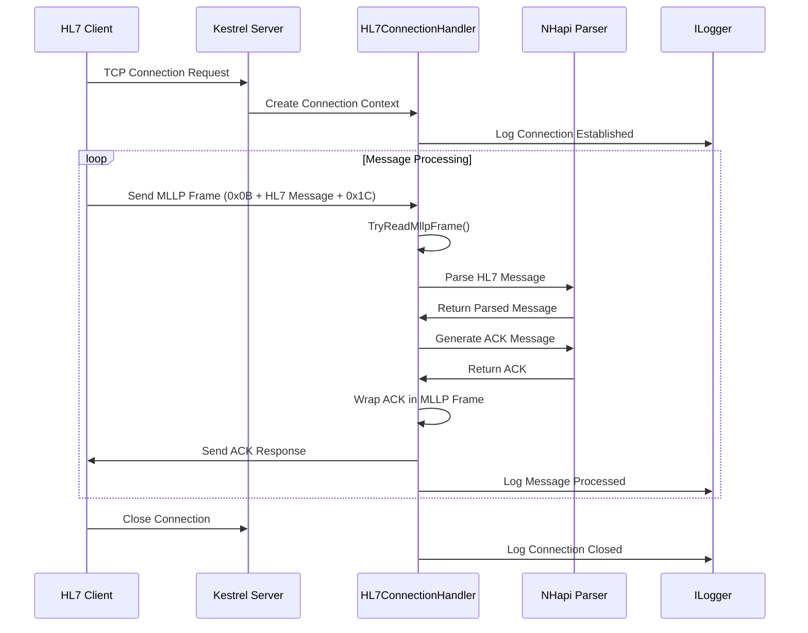

# HL7TCPListener

A high-performance HL7 message listener built on ASP.NET Core 8 Kestrel Server framework that supports the Minimal Lower Layer Protocol (MLLP) for healthcare data exchange.

## Overview

HL7TCPListener is a robust TCP server implementation designed to receive, parse, and acknowledge HL7 (Health Level 7) messages over TCP connections using the MLLP protocol. It leverages the power of ASP.NET Core 8's Kestrel server for high-performance, scalable message processing.

## Features

- **High Performance**: Built on ASP.NET Core 8 Kestrel server for optimal performance
- **MLLP Protocol Support**: Full implementation of Minimal Lower Layer Protocol for HL7 message framing
- **TLS/SSL Support**: Optional encrypted connections with certificate-based authentication
- **Automatic ACK Generation**: Automatic acknowledgment generation for received HL7 messages
- **Comprehensive Logging**: Detailed logging for connection management and message processing
- **NHapi Integration**: Uses NHapi library for robust HL7 message parsing and validation
- **Flexible Configuration**: Easy configuration for different environments and use cases

## Architecture Design

### Components

1. **AppBuilderExtensions**: Extension methods for configuring HL7 support in ASP.NET Core applications
2. **HL7ConnectionHandler**: Core connection handler for processing MLLP frames and HL7 messages
3. **MLLP Protocol Handler**: Built-in support for MLLP framing (0x0B start, 0x1C end markers)
4. **HL7 Parser**: Integration with NHapi for message parsing and ACK generation

### Design Patterns

- **Extension Method Pattern**: For clean integration with ASP.NET Core's builder pattern
- **Handler Pattern**: Dedicated connection handlers for processing TCP connections
- **Pipeline Pattern**: Uses ASP.NET Core's pipeline architecture for message processing
- **Dependency Injection**: Full support for ASP.NET Core's DI container

## Sequence Diagram



## Dependencies

Add the following NuGet package to your project:

```xml
<PackageReference Include="NHapiTools" Version="2.0.4" />
```

## Usage

### ASP.NET Core 8 Application

#### 1. Basic Setup

```csharp
using HL7Listener;
using NHapi.Base.Parser;

var builder = WebApplication.CreateBuilder(args);

// Register the HL7 parser as a singleton
builder.Services.AddSingleton<PipeParser>();

// Configure HL7 TCP listener (without TLS)
builder.AddHL7Support(port: 4040, enableTls: false, pfxCertificate: null, password: null);

var app = builder.Build();

// Your other API endpoints
app.MapGet("/health", () => "HL7 Listener is running");

app.Run();
```

#### 2. Setup with TLS/SSL

```csharp
using HL7Listener;
using NHapi.Base.Parser;

var builder = WebApplication.CreateBuilder(args);

// Register the HL7 parser as a singleton
builder.Services.AddSingleton<PipeParser>();

// Configure HL7 TCP listener with TLS
bool enableTls = true;
string certificatePath = "certificate.pfx";
string certificatePassword = "YourSecurePassword";

builder.AddHL7Support(
    port: 4040, 
    enableTls: enableTls, 
    pfxCertificate: certificatePath, 
    password: certificatePassword);

var app = builder.Build();

app.Run();
```

#### 3. Configuration with appsettings.json

```json
{
  "HL7Listener": {
    "Port": 4040,
    "EnableTls": false,
    "CertificatePath": "certificate.pfx",
    "CertificatePassword": "YourPassword"
  },
  "Logging": {
    "LogLevel": {
      "Default": "Information",
      "HL7Listener": "Debug"
    }
  }
}
```

```csharp
using HL7Listener;
using NHapi.Base.Parser;

var builder = WebApplication.CreateBuilder(args);

// Register services
builder.Services.AddSingleton<PipeParser>();

// Read configuration
var hl7Config = builder.Configuration.GetSection("HL7Listener");
int port = hl7Config.GetValue<int>("Port");
bool enableTls = hl7Config.GetValue<bool>("EnableTls");
string? certPath = hl7Config.GetValue<string>("CertificatePath");
string? certPassword = hl7Config.GetValue<string>("CertificatePassword");

// Configure HL7 support
builder.AddHL7Support(port, enableTls, certPath, certPassword);

var app = builder.Build();
app.Run();
```

### Console Application

```csharp
using HL7Listener;
using Microsoft.AspNetCore.Hosting;
using Microsoft.Extensions.DependencyInjection;
using Microsoft.Extensions.Hosting;
using Microsoft.Extensions.Logging;
using NHapi.Base.Parser;

class Program
{
    static async Task Main(string[] args)
    {
        var builder = WebApplication.CreateBuilder(args);
        
        // Configure logging
        builder.Logging.ClearProviders();
        builder.Logging.AddConsole();
        builder.Logging.SetMinimumLevel(LogLevel.Information);
        
        // Register services
        builder.Services.AddSingleton<PipeParser>();
        
        // Configure HL7 listener
        builder.AddHL7Support(
            port: 4040, 
            enableTls: false, 
            pfxCertificate: null, 
            password: null);
        
        var app = builder.Build();
        
        Console.WriteLine("HL7 TCP Listener starting on port 4040...");
        Console.WriteLine("Press Ctrl+C to stop the server");
        
        // Handle Ctrl+C gracefully
        Console.CancelKeyPress += (sender, e) =>
        {
            e.Cancel = true;
            app.StopAsync().Wait();
        };
        
        try
        {
            await app.RunAsync();
        }
        catch (Exception ex)
        {
            Console.WriteLine($"Error: {ex.Message}");
        }
        
        Console.WriteLine("HL7 TCP Listener stopped.");
    }
}
```

### Minimal Console Application

```csharp
using HL7Listener;
using NHapi.Base.Parser;

// Create and configure the application
var builder = WebApplication.CreateBuilder();
builder.Services.AddSingleton<PipeParser>();
builder.AddHL7Support(4040, false, null, null);

var app = builder.Build();

Console.WriteLine("HL7 Listener running on port 4040. Press any key to stop...");
Console.ReadKey();
```

## Project Structure

```
HL7TCPListener/
├── HL7Listener/
│   ├── AppBuilderExtensions.cs      # Extension methods for ASP.NET Core integration
│   ├── HL7ConnectionHandler.cs      # Core TCP connection and MLLP processing
│   ├── Program.cs                   # Example ASP.NET Core application
│   ├── HL7Listener.csproj          # Project file with dependencies
│   └── Properties/
│       └── launchSettings.json     # Development settings
├── README.md                        # This documentation
└── LICENSE                         # License information
```

## Configuration Options

| Parameter | Type | Required | Description |
|-----------|------|----------|-------------|
| `port` | `int` | Yes | TCP port number to listen on (e.g., 4040) |
| `enableTls` | `bool` | Yes | Whether to enable TLS/SSL encryption |
| `pfxCertificate` | `string?` | Conditional | Path to PFX certificate file (required if TLS enabled) |
| `password` | `string?` | Conditional | Certificate password (required if TLS enabled) |

## MLLP Protocol Details

The Minimal Lower Layer Protocol (MLLP) is used for framing HL7 messages over TCP:

- **Start Block**: `0x0B` (vertical tab)
- **End Block**: `0x1C` (file separator)  
- **Carriage Return**: `0x0D` (carriage return)

**Frame Format**: `<SB>HL7_MESSAGE<EB><CR>`

## Testing the Listener

You can test the HL7 listener using various tools:

### Using PowerShell (Windows)

```powershell
# Create a simple HL7 message with MLLP framing
$startBlock = [char]0x0B
$endBlock = [char]0x1C
$cr = [char]0x0D

$hl7Message = "MSH|^~\&|SendingApp|SendingFacility|ReceivingApp|ReceivingFacility|20231201120000||ADT^A01|123456|P|2.4"
$mllpFrame = $startBlock + $hl7Message + $endBlock + $cr

# Send to the listener
$tcpClient = New-Object System.Net.Sockets.TcpClient
$tcpClient.Connect("localhost", 4040)
$stream = $tcpClient.GetStream()
$data = [System.Text.Encoding]::UTF8.GetBytes($mllpFrame)
$stream.Write($data, 0, $data.Length)

# Read response
$buffer = New-Object byte[] 1024
$bytesRead = $stream.Read($buffer, 0, $buffer.Length)
$response = [System.Text.Encoding]::UTF8.GetString($buffer, 0, $bytesRead)
Write-Host "Response: $response"

$stream.Close()
$tcpClient.Close()
```

## Error Handling

The listener includes comprehensive error handling:

- **Connection Errors**: Logged with connection details
- **Parsing Errors**: Invalid HL7 messages are logged but don't crash the connection
- **MLLP Framing Errors**: Malformed frames are handled gracefully
- **Certificate Errors**: TLS configuration issues are reported clearly

## Performance Considerations

- Uses ASP.NET Core's high-performance Kestrel server
- Asynchronous processing for all I/O operations
- Memory-efficient buffer management with `ReadOnlySequence<byte>`
- Connection pooling handled by Kestrel
- Supports multiple concurrent connections

## Security

- Optional TLS/SSL encryption support
- Certificate-based authentication
- Input validation through NHapi parsing
- No sensitive data logged by default

## Contributing

1. Fork the repository
2. Create a feature branch
3. Make your changes with appropriate tests
4. Update documentation as needed
5. Submit a pull request


## License

This project is licensed under the MIT License - see the LICENSE file for details.

## Support

For issues, questions, or contributions, please use the GitHub issue tracker.
